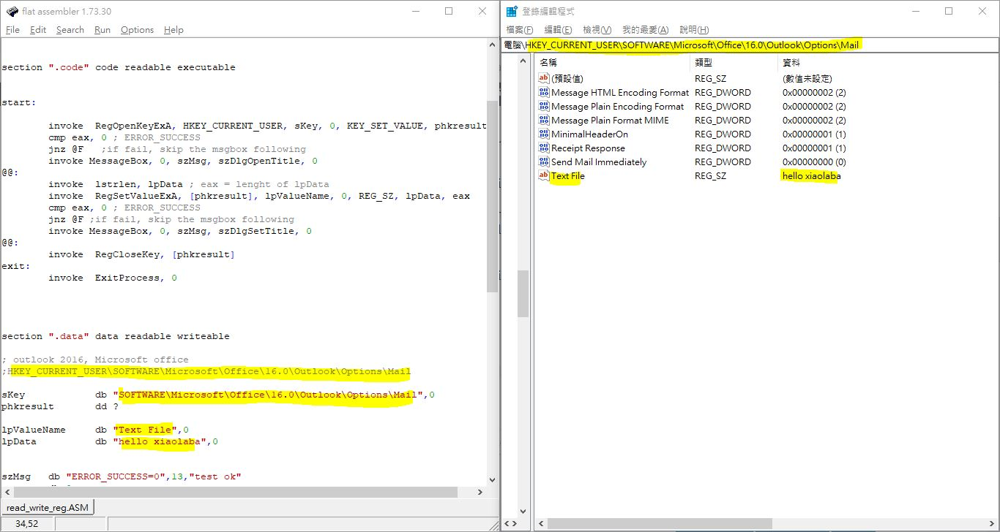

# outlook2016_vba_send_mail_immediately
regkey does not work for purpose

MS solution did not works,  
https://learn.microsoft.com/en-us/outlook/troubleshoot/synchronization/email-stays-in-outbox-until-manually-send-or-receive

unless close the outlook and then launch again

### ASM testing  
code, [read_write_reg.ASM](read_write_reg.ASM)  
ext, [read_write_reg.EXE](read_write_reg.EXE)  
result,  


### reg cli testing  
[test_reg_add.bat](test_reg_add.bat)  


### this registry will swtich on/off the setting
[disable_sent_immediate.reg](disable_sent_immediate.reg)  
[enable_sent_immediate.reg](enable_sent_immediate.reg)  


disable immediate send
```
;outlook2016, registry, disable "Send Mail Immediately", email will not send but pending on sendbox even connected to exhange server
;by xiaolaba, 2016

Windows Registry Editor Version 5.00

[HKEY_CURRENT_USER\SOFTWARE\Microsoft\Office\Outlook\Settings\Data]
"global_Advanced_SendImmediately"="{\"name\":\"Advanced_SendImmediately\",\"itemClass\":\"\",\"id\":\"\",\"scope\":\"global\",\"parentSetting\":\"\",\"secondaryKey\":\"\",\"status\":\"PENDINGSYNC\",\"type\":\"Bool\",\"timestamp\":0,\"metadata\":\"\",\"value\":\"false\",\"isFirstSync\":\"false\",\"source\":\"UserOverride\"}"

[HKEY_CURRENT_USER\SOFTWARE\Microsoft\Office\16.0\Outlook\Options\Mail]
"Send Mail Immediately"=dword:00000000
```

enable immediate send
```
;outlook2016, registry, disable "Send Mail Immediately", email will send immediately when connected to exhange server
;by xiaolaba, 2016
Windows Registry Editor Version 5.00

[HKEY_CURRENT_USER\SOFTWARE\Microsoft\Office\Outlook\Settings\Data]
"global_Advanced_SendImmediately"="{\"name\":\"Advanced_SendImmediately\",\"itemClass\":\"\",\"id\":\"\",\"scope\":\"global\",\"parentSetting\":\"\",\"secondaryKey\":\"\",\"status\":\"PENDINGSYNC\",\"type\":\"Bool\",\"timestamp\":0,\"metadata\":\"\",\"value\":\"true\",\"isFirstSync\":\"false\",\"source\":\"UserOverride\"}"

[HKEY_CURRENT_USER\SOFTWARE\Microsoft\Office\16.0\Outlook\Options\Mail]
"Send Mail Immediately"=dword:00000001
```
